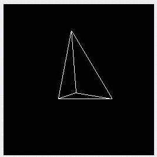

Back in college, for a final project, I did a simple line rendered, 3d-ish demo in MIPS assembly using the MARS ([**M**IPS **A**ssembler and **R**untime **S**imulator](http://courses.missouristate.edu/KenVollmar/MARS/)).

  
It runs a little bit better in the simulator.

I've always liked assembly, so I'm going to port the code into a Real mode x86 version, borrowing from [FloppyBird](https://github.com/icebreaker/floppybird) and [MikeOS](http://mikeos.sourceforge.net/) where needed (might need to check the license on the latter...).
